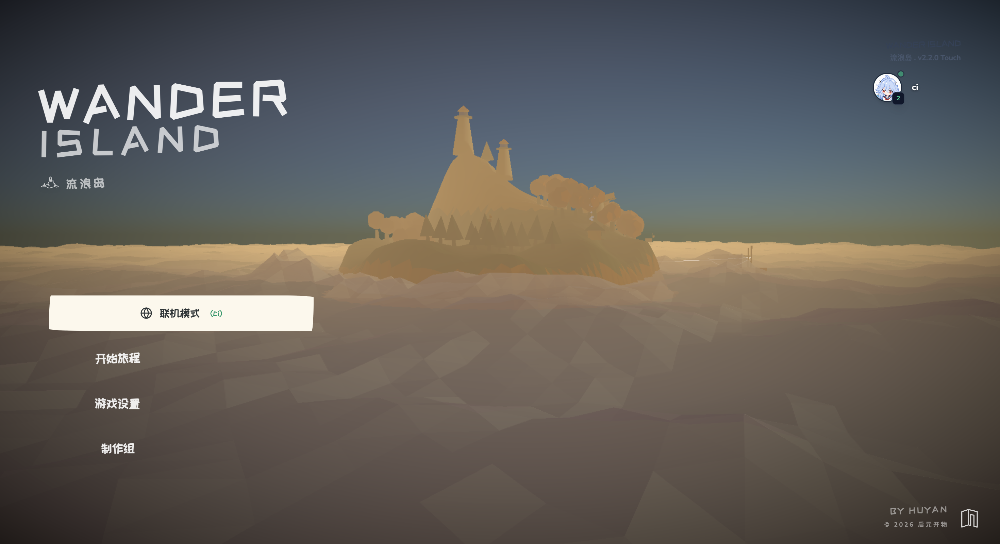
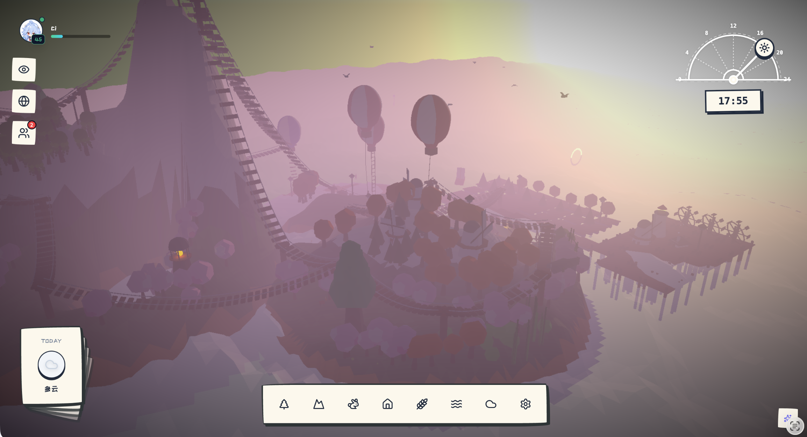
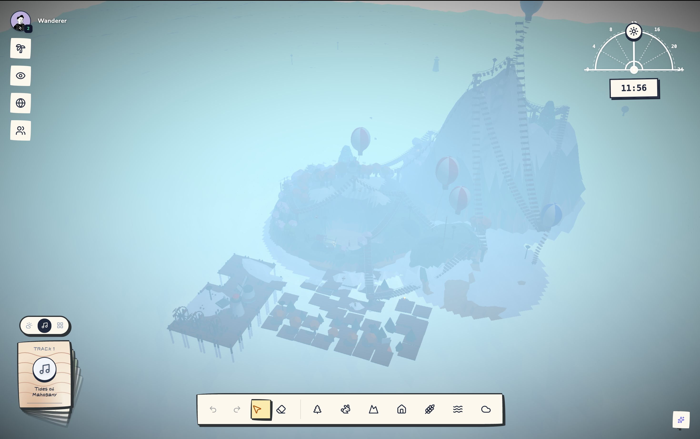
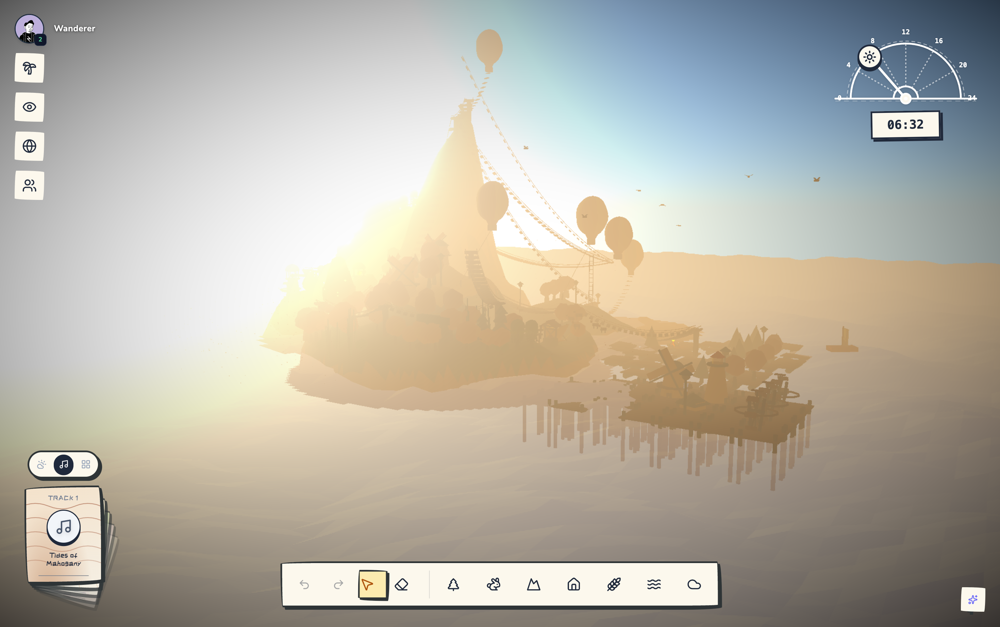
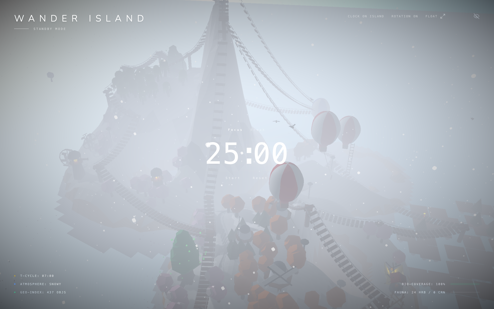
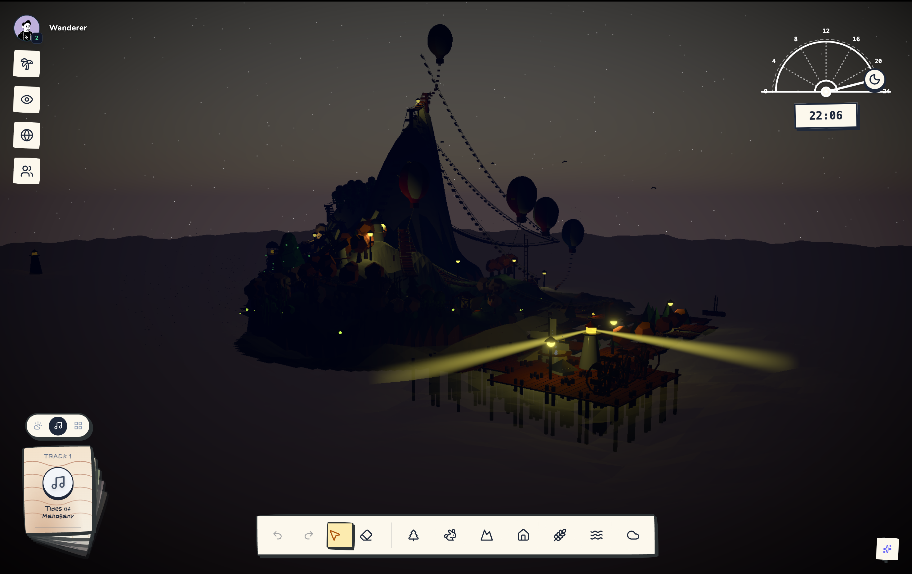

<div align="center">


# 流浪岛 · Wander Island

**叙事驱动的 3D 生态沙盒——在云海碎片上，培育一座会呼吸的岛。**

[](https://wander.qiyuankaiwu.com/)

[](https://www.typescriptlang.org/)
[](https://react.dev/)
[](https://threejs.org/)
[](https://vitejs.dev/)
[](https://expressjs.com/)
[](https://socket.io/)
[](https://github.com/WiseLibs/better-sqlite3)

[项目简介](#项目简介) · [核心系统](#核心系统) · [技术架构](#技术架构) · [快速开始](#快速开始) · [AI 协作规范](AGENTS.md) · [项目结构](#项目结构) · [游戏截图](#游戏截图) · [游戏流程](#游戏流程)

</div>

---

## 项目简介

**流浪岛（Wander Island: Eco-Sandbox）** 是一款运行在浏览器中的 3D 生态沙盒模拟游戏。玩家在云海之上的碎片岛屿上，通过种植植被、引入动物、建造设施来培育一个动态平衡的微型生态系统。游戏融合了叙事碎片收集、AI 岛灵对话、卡牌策略生存、多人社交互动等系统，创造了一个以「倾听」为核心的沉浸式体验。

> **无需安装，打开浏览器即可体验：** [wander.qiyuankaiwu.com](https://wander.qiyuankaiwu.com/)

---

## 核心系统

### 1. 生态沙盒

游戏的核心循环是 **放置 → 共生 → 演化**。每一个物件都不是孤立的装饰——它们在生态系统中扮演着结构性角色。

**动态生态引擎：**
- 植被、动物、水源形成真实的食物链依赖关系
- 森林群落自动检测：3 棵以上树木聚集形成森林簇，触发鹿群自然繁殖
- 过度放牧机制：鹿群数量超过承载力时，草地健康度下降
- 泉水与降雨自动恢复草地健康度
- 生态健康度驱动全局状态：影响音乐清晰度、AI 岛灵语言能力、被动 Eco 收益

**地形雕刻系统：**
- 5 种笔刷模式：抬升（Raise）、沉降（Lower）、平整（Flatten）、平滑（Smooth）、擦除（Erase）
- 可调节笔刷大小与力度，支持精细地形塑造
- 子岛（副岛）独立地形编辑，通过桥梁与主岛连接
- 地形数据持久化存储，加载后完整还原

**40+ 可放置物件，分为 7 大类：**

| 类别 | 物件 | 生态功能 |
|------|------|----------|
| **植被** | 橡树、秋季树、松树、樱花树、竹子、垂柳、灌木、远古神树 | 生成 Eco、形成森林群落、支撑鹿群 |
| **动物** | 鹿、狼、海鸥、海豚、荧光鱼群 | 鹿消耗草地、狼控制鹿群、海鸥可被海鸥亭聚集 |
| **水源** | 生命之泉、池塘 | 恢复草地健康、触发「水土丰茂」共生 |
| **建筑** | 小屋、风车、灯塔、观星台、遗迹石门、水车 | 风车产生被动 Eco、灯塔夜间旋转光束 |
| **海洋工程** | 浮板、码头、小船、桥梁、打桩、悬索桥、热气球（系绳/软梯/吊桥） | 扩展岛屿空间、连接副岛 |
| **生活设施** | 帐篷、营火、栅栏、水井、长椅、路灯、路牌、信箱 | 营火夜间闪烁、信箱接收邮件 |
| **农业** | 锄头、小麦种子、胡萝卜种子 | 农田耕作、作物生长与成熟 |

**5 种生态地貌：**
- 经典（默认）— 标准岛屿生态
- 森林 — 繁茂过度的段落
- 沙漠 — 墨水干涸的段落
- 冰封 — 时间凝固的段落
- 火山 — 情感过载的段落

---

### 2. 天气与时间系统

**昼夜循环：**
- 完整的 24 小时昼夜循环，1 现实分钟 = 1 游戏小时
- 可拖拽日晷（Solar Meridian）手动调节时间
- 动态天光：日出金橙 → 正午白光 → 黄昏暖红 → 夜晚深蓝
- 实时阴影随太阳角度变化

**6 种天气类型：**
- 晴天、多云、雨天、雾天、雪天、暴风
- 天气影响生态：雨天加速草地恢复、雨天植物 Eco 产出翻倍
- 3 日天气预报系统，每日自动推进

**4 季轮转：**
- 春夏秋冬四季切换，影响植被外观与生态参数
- 冬季降雪效果，季节与天气联动

---

### 3. 回声 · 音乐系统

6 首原创环境音乐，每首对应岛屿上的一个叙事回声容器。音乐不是简单的背景音——**它是生态系统的诊断仪**。

| 曲目 | 回声容器 | 音乐叙事 |
|------|----------|----------|
| *Tides of Mahogany* | 风车 | 沉船红木甲板上的潮汐记忆 |
| *Glockenspiel Sunprint* | 观星台 | 永恒清晨中阳光替人敲响的钟琴 |
| *The Architecture of Leaves* | 远古神树 | 被森林吞没的图书馆，叶脉在朗读自己 |
| *Sakura Drifting Down* | 樱花树 | 岛屿学会的唯一一种告别 |
| *Lighthouse Beam* | 灯塔 | 守岛人变成灯塔后仍在旋转的光 |
| *Before the First Snow* | 整座岛 | 永远停在初雪落下前一刻的等待 |

**生态驱动音乐清晰度：**
- 生态健康时：旋律完整、和声清晰
- 生态失衡时：段落缺失、音符走调
- 生态崩溃时：音乐消散为噪音与嗡鸣

音乐以「记忆卡」形式收集，每张卡片附带独特的渐变纹理与叙事短文。部分卡片通过邮件系统限量发放。

---

### 4. AI 岛灵「辞」

岛灵「辞」是岛屿上残存的意识碎片，玩家可以与它对话。这不是普通的 AI 聊天——**辞的语言能力与生态健康度直接绑定**：

| 生态状态 | 辞的表达能力 | 示例 |
|----------|-------------|------|
| 生态极佳 | 完整段落、小故事 | 有韵律感的叙事性语言 |
| 生态良好 | 完整句子 | 逻辑跳跃的碎片拼凑 |
| 生态一般 | 短语 | 梦呓般的不完整语句 |
| 生态崩溃 | 单个词语 | "等待""遗忘""光""循环" |
| 生态死亡 | 沉默 | 空气中残留的温度 |

辞的对话由 OpenAI API 驱动，系统提示词融入了岛屿的叙事语境，使对话具有独特的文学质感。

---

### 5. 生生不息 · 卡牌策略模式

除自由创造模式外，游戏提供「生生不息」策略生存模式。玩家从一副卡牌中抽取并打出，每次出牌即放置对应的 3D 物件。

**6 种卡牌：**

| 卡牌 | 映射物件 | Eco 消耗 | 营养级 | 共生提示 |
|------|----------|----------|--------|----------|
| 橡树 | 橡树 | 10 | 生产者 | 靠近水源更繁茂 · 喂养鹿群 |
| 松树 | 秋季树 | 10 | 生产者 | 靠近水源更繁茂 · 喂养鹿群 |
| 水源 | 生命之泉 | 15 | 水源 | 滋养周围的树木 |
| 鹿 | 鹿 | 20 | 食草动物 | 需要树木供食 · 是狼的猎物 |
| 狼 | 狼 | 30 | 捕食者 | 捕食鹿，闭合食物链 |
| 岩石 | 岩石 | 5 | 中性 | 点缀风景（无共生） |

**三级共生连锁：**
1. **水土丰茂**（树 + 水源）→ Eco +8
2. **鹿群觅食**（鹿 + 树）→ Eco +16
3. **食物链闭合**（狼 + 鹿）→ Eco +30，本季 Eco 翻倍

每推进一个季节，生态自动演化、天气推进、手牌补充。牌库循环，无限经营。

---

### 6. 社交与多人

基于 Socket.IO 的实时多人系统：

**串门系统：**
- 访问其他玩家的岛屿，实时浏览他们的生态建设
- 跨岛碎片共鸣：当两个相关岛屿的玩家同时在场时，触发特殊叙事碎片

**漂流瓶：**
- 向云海投递消息，其他玩家随机拾取
- 消息被叙述语法自动修饰——生态良好的岛屿发出的文字更具诗意

**好友系统：**
- 添加好友、发送好友请求
- 好友间可互赠礼物（物件/语法赠送）
- 互动频率影响叙事连接强度

**信箱与邮件：**
- 岛屿上放置信箱物件，接收系统邮件与好友来信
- 限量音乐记忆卡通过邮件发放

**聊天系统：**
- 实时文字聊天，Socket.IO 驱动

---

### 7. 成就系统

11 项成就，基于游戏内真实行为自动解锁：

| 成就 | 解锁条件 |
|------|----------|
| 第一棵树 | 种下第一棵树 |
| 安家落户 | 建起第一座建筑 |
| 小岛初成 | 放置 10 个物件 |
| 繁荣之岛 | 放置 50 个物件 |
| 生机盎然 | 放置 120 个物件 |
| 初见生灵 | 岛上迎来第一只鹿 |
| 生态平衡 | 同时拥有树木、鹿与狼 |
| 留下足迹 | 立起一块写字牌 |
| 资深漫游者 | 等级达到 5 级 |
| 静谧时光 | 在岛上停留 10 分钟 |
| 记忆收藏家 | 集齐全部音乐记忆卡 |

---

### 8. 番茄钟 · 专注模式

内置番茄钟工具，嵌入沉浸式待机界面：
- 25 分钟专注 / 5 分钟休息，经典番茄工作法
- 电影级遥测风格数字显示，翻页式切换动画
- 在岛屿的宁静中专注工作，休息时欣赏你的生态建设

---

### 9. 存档与进度

**多存档系统：**
- 支持多个独立存档位，每个存档对应一座独立岛屿
- 存档数据包含：物件布局、地形数据、生态状态、天气、解锁进度
- 自动保存至 localStorage，支持导出/导入

**全局进度：**
- 经验值与等级跨所有岛屿累加
- 解锁的物件类型全局共享
- 音乐记忆卡收藏全局统计

**撤销/重做：**
- 最多 40 步操作历史，支持撤销与重做
- 放置、删除、擦除操作均可回退

---

## 技术架构

```
┌──────────────────────────────────────────────────────────────┐
│                         Frontend                              │
│                                                               │
│   React 19 · Zustand 5 · Tailwind CSS 4 · Motion             │
│   Three.js r184 · @react-three/fiber 9 · @react-three/drei   │
│   @react-three/postprocessing · simplex-noise · Lucide Icons  │
│   Vite 6 (HMR + Code Splitting)                               │
├──────────────────────────────────────────────────────────────┤
│                         Backend                               │
│                                                               │
│   Express 4 · Socket.IO 4 · better-sqlite3                   │
│   JWT (jsonwebtoken) · bcryptjs · cookie-parser               │
│   OpenAI API · multer · cors · https-proxy-agent              │
├──────────────────────────────────────────────────────────────┤
│                       Data & Auth                             │
│                                                               │
│   SQLite (better-sqlite3) · localStorage · JWT Bearer Token   │
│   DiceBear Avatar API · QR Code Generation                    │
└──────────────────────────────────────────────────────────────┘
```

### 技术选型说明

| 领域 | 技术 | 选型理由 |
|------|------|----------|
| **3D 渲染** | Three.js + React Three Fiber | 声明式 3D 场景管理，React 组件化开发 |
| **3D 扩展** | @react-three/drei | 开箱即用的 3D 工具集（OrbitControls、Sky、Environment 等） |
| **后处理** | @react-three/postprocessing | Bloom、DOF 等电影级视觉效果 |
| **状态管理** | Zustand | 轻量、无 boilerplate、支持中间件 |
| **样式** | Tailwind CSS 4 | 原子化 CSS，暗色主题，零运行时 |
| **动画** | Motion (Framer Motion) | 声明式动画，手势支持 |
| **实时通信** | Socket.IO | 自动降级、房间机制、广播 |
| **数据库** | better-sqlite3 | 同步 API、零配置、嵌入式部署 |
| **地形生成** | simplex-noise | 程序化噪声地形，可调节参数 |
| **AI 对话** | OpenAI API | 岛灵叙事对话生成 |
| **构建** | Vite 6 | 极速 HMR、原生 ESM、代码分割 |

### API 端点

| 模块 | 路由文件 | 功能 |
|------|----------|------|
| 认证 | `auth.ts` | 注册、登录、JWT 签发、头像上传 |
| 岛屿 | `islands.ts` | 岛屿 CRUD、数据同步 |
| 好友 | `friends.ts` | 好友请求、好友列表 |
| 聊天 | `chat.ts` | 实时消息、聊天记录 |
| 信箱 | `mailbox.ts` | 邮件收发、系统通知 |
| 访客 | `visitors.ts` | 串门记录、访客簿 |
| 漂流瓶 | `bottles.ts` | 投递与拾取 |
| 礼物 | `gifts.ts` | 物件赠送 |
| 管理 | `admin.ts` | 后台管理 |

---

## 快速开始

### 在线体验

直接访问 [wander.qiyuankaiwu.com](https://wander.qiyuankaiwu.com/)，注册账号后即可开始游戏，无需安装任何软件。

### 本地开发

**环境要求：** Node.js >= 18

```bash
# 1. 克隆仓库
git clone https://github.com/huyan1349/wander-island-eco-sandbox.git
cd wander-island-eco-sandbox

# 2. 安装依赖
npm install

# 3. 配置环境变量
cp .env.example .env.local
# 编辑 .env.local，填入以下配置：
#   OPENAI_API_KEY     — OpenAI API 密钥（岛灵对话功能）
#   JWT_SECRET         — JWT 签名密钥
#   其他配置参见 .env.example

# 4. 启动前端开发服务器（端口 3002）
npm run dev

# 5. 启动后端服务（另一个终端，端口 3001）
npm run server

# 6. 初始化数据库种子数据（首次运行）
npm run seed
```

### 可用脚本

| 命令 | 说明 |
|------|------|
| `npm run dev` | 启动 Vite 开发服务器（端口 3002，支持 HMR） |
| `npm run server` | 启动 Express 后端服务（端口 3001） |
| `npm run build` | 构建前端生产版本至 `dist/` |
| `npm run preview` | 预览生产构建 |
| `npm run lint` | TypeScript 类型检查（`tsc --noEmit`） |
| `npm run seed` | 初始化/重置数据库种子数据 |

---

## 项目结构

```
wander-island-eco-sandbox/
├── src/                          # 前端源码
│   ├── App.tsx                   # 主应用组件（工具栏、面板、路由）
│   ├── store.ts                  # Zustand 全局状态（生态引擎、存档、Flourish）
│   ├── main.tsx                  # 入口
│   ├── index.css                 # 全局样式
│   ├── components/               # UI 组件
│   │   ├── GameCanvas.tsx        # Three.js 3D 场景容器
│   │   ├── Terrain.tsx           # 地形网格 + 笔刷交互
│   │   ├── Water.tsx             # 海洋/水面渲染
│   │   ├── SkySystem.tsx         # 天空盒 + 日夜天光
│   │   ├── Assets.tsx            # 3D 物件注册/分发层
│   │   ├── assets/               # 3D 物件模块（海洋、建筑、生物、水体、地标、交互道具）
│   │   ├── TitleScreen.tsx       # 标题画面
│   │   ├── LoginScreen.tsx       # 登录/注册
│   │   ├── SaveSelectScreen.tsx  # 存档选择
│   │   ├── OnboardingFlow.tsx    # 新手引导
│   │   ├── LoadingScreen.tsx     # 加载画面
│   │   ├── PlayerPanel.tsx       # 玩家面板（成就、设置、社交等）
│   │   ├── SocialPanel.tsx       # 社交面板
│   │   ├── SocialPlaza.tsx       # 社交广场（浏览其他岛屿）
│   │   ├── FlourishHUD.tsx       # 生生不息卡牌 HUD
│   │   ├── AchievementSystem.tsx # 成就弹窗
│   │   ├── IslandClock.tsx       # 岛屿时钟
│   │   ├── PomodoroTimer.tsx     # 番茄钟
│   │   ├── MailboxModal.tsx      # 信箱弹窗
│   │   ├── GiftModal.tsx         # 礼物弹窗
│   │   ├── SignEditorModal.tsx   # 路牌文字编辑
│   │   ├── VisitorBookModal.tsx  # 访客簿
│   │   ├── VisitOverlay.tsx      # 串门覆盖层
│   │   ├── IslandHubModal.tsx    # 岛屿中心
│   │   ├── HermitOnline.tsx      # 在线状态
│   │   ├── WelcomeGuide.tsx      # 欢迎引导
│   │   ├── Toast.tsx             # 消息提示
│   │   ├── SoundLayer.tsx        # 环境音层
│   │   ├── systems/
│   │   │   └── TimeWeatherSystem.tsx  # 时间天气引擎
│   │   └── ui/
│   │       ├── MusicLibrary.tsx  # 音乐库（记忆卡收藏）
│   │       ├── SolarMeridian.tsx # 日晷时间控制器
│   │       ├── WeatherForecast.tsx # 天气预报
│   │       └── musicData.tsx     # 曲目数据 + 卡片纹理
│   ├── game/
│   │   └── flourish.ts           # 生生不息卡牌逻辑（共生评估、牌库）
│   ├── lib/
│   │   ├── api.ts                # HTTP API 客户端
│   │   ├── audio.ts              # 音频引擎（环境音、共生和弦、生态混音）
│   │   ├── socket.ts             # Socket.IO 客户端
│   │   ├── achievements.ts       # 成就定义与评估
│   │   └── globalProgress.ts     # 全局 XP/等级系统
│   └── utils/
│       ├── terrain.ts            # 地形工具函数
│       ├── terrainBrush.ts       # 地形笔刷算法
│       └── islandIO.ts           # 岛屿导入/导出
├── server/                       # 后端源码
│   ├── index.ts                  # Express 入口 + Socket.IO
│   ├── auth.ts                   # JWT 认证中间件
│   ├── db.ts                     # SQLite 数据库初始化
│   ├── socket.ts                 # Socket.IO 事件处理
│   ├── seed.ts                   # 数据库种子
│   └── routes/
│       ├── auth.ts               # 认证路由
│       ├── islands.ts            # 岛屿路由
│       ├── friends.ts            # 好友路由
│       ├── chat.ts               # 聊天路由
│       ├── mailbox.ts            # 信箱路由
│       ├── visitors.ts           # 访客路由
│       ├── bottles.ts            # 漂流瓶路由
│       ├── gifts.ts              # 礼物路由
│       └── admin.ts              # 管理路由
├── public/                       # 静态资源
│   ├── fonts/                    # 自托管字体（Nunito、Raleway、站酷快乐体）
│   ├── title/                    # 标题画面资源
│   ├── *.mp3                     # 6 首原创环境音乐
│   ├── manifest.json             # PWA 清单
│   └── preset-*.json             # 预设岛屿模板
├── docs/                         # 项目文档
│   └── narrative/                # 世界观与叙事设计
└── 预置岛屿/                     # 预设岛屿存档 JSON
```

---

## 游戏截图

<div align="center">




*黄昏岛屿全景 · 云海之上的浮岛* ｜ *樱花盛放 · 岛屿建设主界面*




*冰封地貌 · 时间凝固的段落* ｜ *樱花与冰雪 · 生态地貌的交织*




*冰封世界 · 永冬之岛* ｜ *夜幕降临 · 岛灵「辞」的低语*

</div>

---

## 游戏流程

```
注册/登录 → 选择/创建存档 → 进入岛屿
                                    │
                    ┌───────────────┼───────────────┐
                    ▼               ▼               ▼
              自由创造模式     生生不息模式      社交互动
              ┌─────────┐    ┌──────────┐    ┌──────────┐
              │ 放置物件 │    │ 抽取卡牌 │    │ 串门拜访 │
              │ 雕刻地形 │    │ 共生连锁 │    │ 漂流瓶   │
              │ 培育生态 │    │ 季节推进 │    │ 好友互动 │
              │ 收集回声 │    │ 食物链   │    │ 礼物赠送 │
              │ 与辞对话 │    │ 策略经营 │    │ 实时聊天 │
              └────┬────┘    └────┬─────┘    └────┬─────┘
                   │              │               │
                   └──────────────┼───────────────┘
                                  ▼
                           成就解锁 · 等级提升
                           音乐收藏 · 叙事碎片
                                  │
                                  ▼
                           沉浸待机 · 番茄钟
                           在岛屿的宁静中专注
```

---

## 贡献

这是一个个人创作项目，欢迎所有形式的交流与灵感碰撞：

- 提交 [Issue](https://github.com/huyan1349/wander-island-eco-sandbox/issues) 分享想法或反馈 Bug
- Fork 后提交 Pull Request
- 在游戏中向云海投递一个漂流瓶

---

## 许可

本项目为个人创作项目，版权所有。

---

<div align="center">

*你建造的不是岛屿。是叙述在试图重新拥有语法。*
— huyan

**流浪岛 · Wander Island** · v2.0.0

</div>
